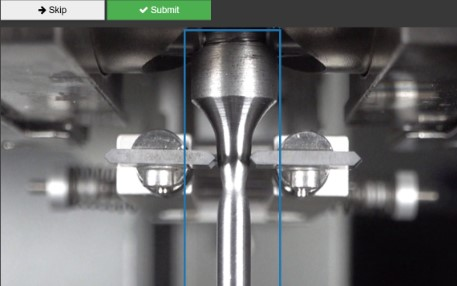
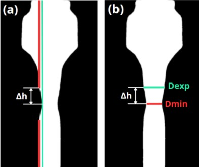

# Tensile Testing Analysis with Computer Vision

This project is part of an undergraduate thesis at **LABMAN – PUCP** (Pontificia Universidad Católica del Perú). It involves the use of **Computer Vision and AI** to assist in the analysis of tensile strength tests on various metal specimens.

## Project Overview

- Processed video footage of tensile tests on cylindrical and flat specimens made of **ASTM A36**, **430**, and **304 stainless steel**.
- Integrated **SAM (Segment Anything Model)** to segment the test samples and track shape changes during elongation.
- Developed algorithms to estimate the **minor diameter** and **radius of curvature** of specimens throughout the test.

## Tools & Technologies

- Python
- OpenCV
- Meta AI's SAM (Segment Anything)
- Numpy & SciPy

---
## Gallery 

*ROI Selection*

*ROI Segmentation*

*This repository supports research on automating the measurement of deformation parameters in tensile testing environments.*
